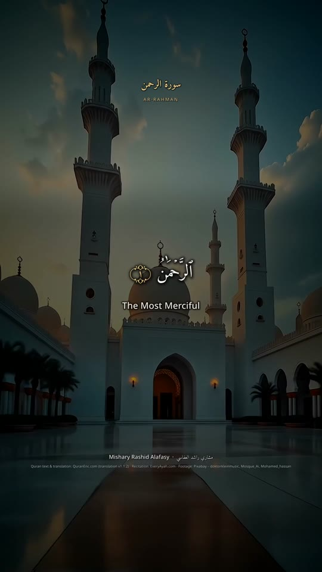
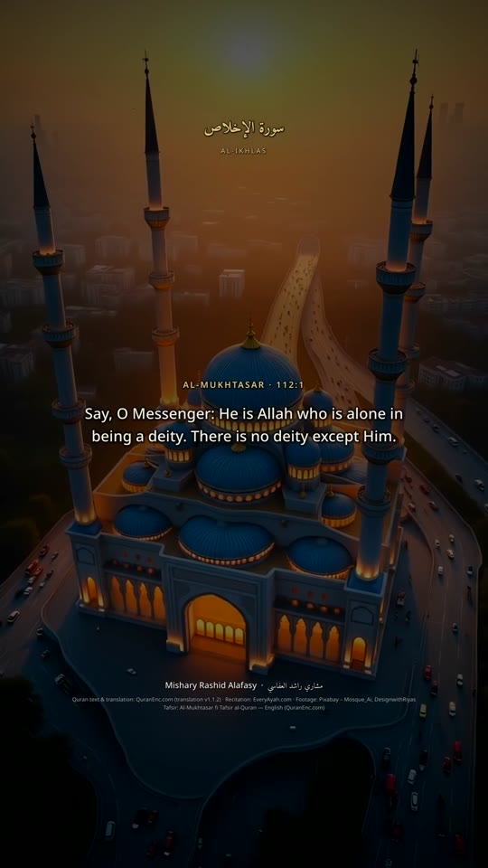
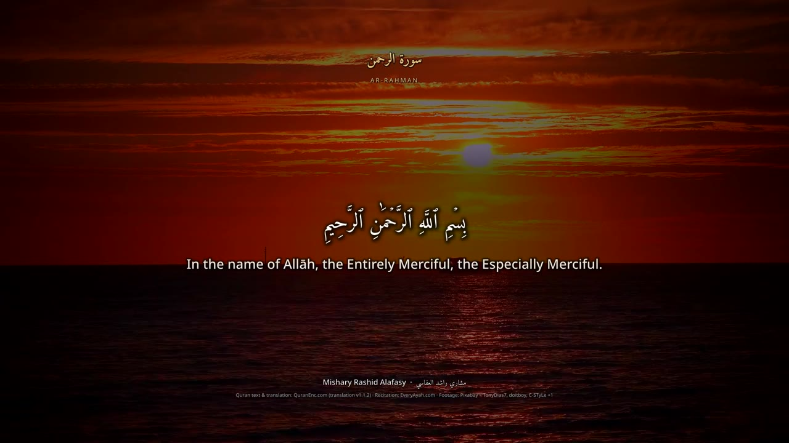
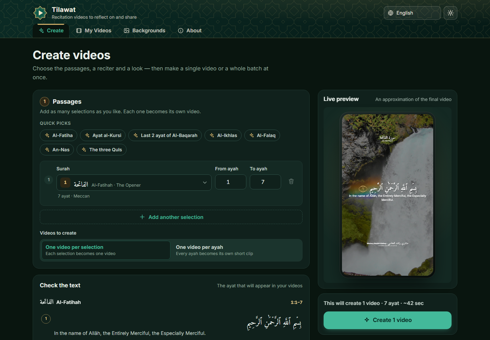

# Quran Video Studio

**Turn Quran recitations into beautiful, share-ready videos — in minutes, on your own computer.**

Pick the ayat, a reciter and a look. Quran Video Studio fetches the verified Arabic text, a
translation and the recitation, lays them over calm nature, space or mosque footage, and renders
finished MP4 videos for Reels, TikTok, YouTube Shorts, WhatsApp Status or YouTube — with the
Arabic perfectly shaped and every ayah appearing exactly while it is recited.

<p align="center">
  
  
  
</p>
<p align="center">
  
</p>

> *(“Quran Video Studio” is a working title — the name lives in `public/i18n/*.json` → `app.name`
> and `server/lib/brand.js`.)*

---

## What it offers

| | |
|---|---|
| 📖 **Verified Quran text** | Uthmani Arabic and translations from [QuranEnc.com](https://quranenc.com), shown verbatim — never retyped, generated or "fixed". |
| 🎙️ **29 reciters** | Alafasy, Abdul Basit, Al-Husary, Al-Minshawi, As-Sudais, Ash-Shuraym, Maher Al-Muaiqly, Yasser Al-Dosari and more (EveryAyah.com), each audio file verified. |
| 🌍 **~115 translations** | In dozens of languages, or Arabic only. Right-to-left translations (Urdu, Persian…) render correctly. |
| 📚 **Tafsir** | Read Al-Mukhtasar, Al-Muyassar or As-Sa'di under each ayah, and optionally add tafsir cards to the video after each ayah. |
| ⏱️ **Exact timing** | Each ayah's text appears exactly while it is recited; long ayat (e.g. Ayat al-Kursi) are split into readable parts. |
| 🎬 **Many videos at once** | Queue several passages, or turn a range into one video per ayah. |
| 🏞️ **Halal footage** | Nature, space, mosques and Islamic scenes only: a starter library of 40 hand-reviewed clips (vertical and horizontal), NASA Earth-from-orbit footage, Pixabay/Pexels search with a content filter (no people, music, other-religion imagery or logos), and your own uploads. Clip audio is always removed. |
| 📐 **Every format** | 9:16 (Reels, TikTok, Shorts, Status), 16:9 (YouTube), 1:1 (feed) in 1080p or 720p, with a file-size choice: Small (≈ 7 MB per minute, ideal for WhatsApp), Balanced (≈ 13 MB) or High quality (≈ 27 MB). |
| 🎨 **Styling** | Amiri Quran or Scheherazade New, text size and position, background darkness, surah title, reciter name, Bismillah, and on-screen credits (minimal, full or off). Live preview before rendering. |
| 📤 **Sharing** | Share the video file straight to WhatsApp, Instagram, TikTok… (Web Share), links for WhatsApp, Telegram, X, Facebook and email, download, and a **QR code** that opens the video on your phone. |
| 🌐 **12 interface languages** | العربية · اردو · فارسی · English · Français · Türkçe · Bahasa Indonesia · Bahasa Melayu · বাংলা · Español · Deutsch · Русский — with proper right-to-left layouts. |
| 🔒 **Private & local** | Everything runs on your computer. No account, no tracking. |

---

## Quick start

### 1. Install the requirements

You need **Node.js 22.9+** and **FFmpeg 6+**.

| System | Node.js | FFmpeg |
|---|---|---|
| **Windows** | `winget install OpenJS.NodeJS.LTS` | `winget install Gyan.FFmpeg` |
| **macOS** (Homebrew) | `brew install node` | `brew install ffmpeg` |
| **Ubuntu / Debian** | [nodejs.org](https://nodejs.org/en/download) or `nvm install 22` | `sudo apt install ffmpeg` |

Open a new terminal afterwards and check: `node --version` and `ffmpeg -version`.

### 2. Download and start

```bash
git clone https://github.com/<your-account>/<this-repo>.git
cd <this-repo>
npm install
npm start
```

Open **http://localhost:4700** in your browser. The terminal also prints a `Network:` address
that phones on the same Wi-Fi can open (Windows may ask you to allow Node.js through the firewall
the first time — allow it on private networks).

### 3. (Optional) Add a free Pixabay key

The app works immediately with the starter library, NASA footage and your own clips. To search
for more footage, get a free key at [pixabay.com/api/docs](https://pixabay.com/api/docs/), then:

```bash
cp .env.example .env      # Windows: copy .env.example .env
```

Open `.env`, paste your key after `PIXABAY_API_KEY=`, save, and restart with `npm start`.

---

## How to use it

### Create a video

1. **Passages** — choose a surah and the ayah range. Use **Add another selection** to queue more
   passages, or a quick pick (Al-Fatiha, Ayat al-Kursi, the last two ayat of Al-Baqarah, the
   three Quls…).
2. **Output** — *One video per selection* or *One video per ayah* (great for daily posts).
3. **Recitation & translation** — pick a reciter (▶ to preview) and a translation, or *None*
   for Arabic only.
4. **Tafsir** *(optional)* — choose a tafsir to read it under each ayah in **Check the text**.
   Switch on **Add tafsir cards to the video** to show it after each ayah (the video gets longer).
5. **Backgrounds** — pick one or more themes: Nature, Space, Mosques, Islamic. Tick
   *Only use my approved clips* to use nothing but clips you have reviewed.
6. **Format** — 9:16, 16:9 or 1:1, 1080p or 720p, and the file size (Small is best for WhatsApp).
7. **Style** — font, text size, position, background darkness, surah title, reciter name,
   Bismillah and **credits**: *Minimal* (default) shows one small QuranEnc.com line, which its
   terms require; *Full* lists every source; *Off* shows none. With Minimal or Off, the sources are
   added to the text when you share. The **live preview** updates as you go.
8. Check the ayat in **Check the text**, then press **Create**.

Videos render one after another under **My Videos**, with live progress. A one-minute 1080p video
takes about a minute on a typical desktop.

### Share a video

In **My Videos**, open a video's **Share** menu:

- **Share video…** sends the actual MP4 to WhatsApp, Instagram, TikTok, Telegram and other apps
  (Chrome, Edge and Safari on phones and desktops).
- **WhatsApp / Telegram / X / Facebook / Email / Copy link** share a link to the video's page.
- **Download** saves the MP4.
- **QR code** — scan it with your phone to open the video there, then save or share it from the
  phone. The phone must be on the same Wi-Fi, because the link points to your computer.

### Manage backgrounds

Open **Backgrounds**:

- **Approved** shows the clips the app uses first (including the starter library). Remove any you
  don't like — removed starter clips stay removed.
- **Find more** (needs a Pixabay or Pexels key) shows filtered search results to ✓ approve or ✕ reject.
- **Upload** your own clip (MP4, WebM or MOV). Its sound is removed automatically.

Videos prefer clips that match their format, so vertical videos use vertical clips first.

---

## Configuration

All settings are optional and live in `.env` (copy `.env.example`):

| Variable | Default | Purpose |
|---|---|---|
| `PIXABAY_API_KEY` | – | Search Pixabay for more footage (free key). |
| `PEXELS_API_KEY` | – | Search Pexels too (Pexels may not be issuing new keys). |
| `PORT` | `4700` | Port the app listens on. |
| `HOST` | `0.0.0.0` | Interface to listen on (`127.0.0.1` = this computer only). |
| `PUBLIC_BASE_URL` | – | Your public URL if you host the app online; used for share links and QR codes. |
| `RENDER_CONCURRENCY` | `1` | How many videos render at the same time. |
| `FFMPEG_PATH`, `FFPROBE_PATH` | `ffmpeg`, `ffprobe` | Only if FFmpeg is not on your PATH. |

Your videos are saved in `output/`; the app's state in `data/`; downloads are cached in `cache/`
(safe to delete).

---

## Troubleshooting

| Problem | Fix |
|---|---|
| `ffmpeg` not found / renders fail immediately | Install FFmpeg, open a **new** terminal, check `ffmpeg -version`, or set `FFMPEG_PATH`. |
| Phone can't open the QR link | Phone and computer must be on the same Wi-Fi; allow Node.js in the firewall; try another `Network:` address printed at startup. |
| "Share video…" button is missing | Your browser can't share files — use Download, or open the video on your phone via the QR code. |
| No nature/mosque clips found | Use the starter library, upload your own clips, or add a Pixabay key. |
| Port 4700 is busy | Set another `PORT` in `.env`. |

---

## How it works

1. **Text** — Arabic and translations come from QuranEnc.com, verbatim. The only change is for
   display: QuranEnc's KFGQPC encoding of the open tanween is mapped to the standard Unicode
   characters so regular fonts draw it correctly. Translations are credited with their version
   number and refreshed when QuranEnc publishes a new version.
2. **Audio** — each ayah's recitation is downloaded from EveryAyah.com, silence-trimmed and joined;
   the text timing comes from the real audio durations.
3. **Background** — clips are cut into ~7 s segments with crossfades, cropped to the format,
   silenced, darkened and vignetted. With no clips available, an animated gradient is used.
4. **Render** — FFmpeg burns in the text with libass (full Arabic shaping) and encodes an H.264/AAC
   MP4 that plays everywhere.

```
server/
  index.js          app entry (Express)
  quran.js          surahs, translations, ayah text (QuranEnc)
  tafsir.js         tafsir editions and text (QuranEnc)
  reciters.js       reciter list and per-ayah audio (EveryAyah)
  sources/          background footage: starter library, Pixabay, Pexels, NASA, uploads, filter
  render/           FFmpeg pipeline, subtitles, layout, fonts, job queue
  share.js          share links and QR codes
public/             web interface (vanilla JS, no build step), i18n/*.json
assets/fonts/       bundled OFL fonts
docs/               architecture and API reference
scripts/            tests and maintenance scripts
```

Architecture, module interfaces and the REST API: [docs/ARCHITECTURE.md](docs/ARCHITECTURE.md).

---

## Development

```bash
npm run dev               # restart automatically on changes
npm test                  # offline checks: content filter, provider parsing, all 12 UI translations
npm run test:online       # Quran data, reciters and clip downloads (uses the network)
node scripts/render-test.js --surah 1 --from 1 --to 7 --reciter Alafasy_128kbps \
  --translation english_saheeh --aspect 9:16 --categories space   # render without the server
node scripts/check-reciters.js                                     # re-verify reciter audio folders
node --env-file=.env scripts/build-starter-library.js collect      # refresh starter footage candidates
```

### Contributing

Issues and pull requests are welcome — please run `npm test` first.

- **New UI language:** copy `public/i18n/en.json`, add the language to `public/i18n/languages.js`,
  and run `node scripts/check-i18n.js <code> --strict`.
- **Quran text** must always come verbatim from QuranEnc. Never generate, retype or correct it.
- **Footage** must stay within nature, space, mosques and Islamic scenes: no people, music,
  other-religion imagery or logos.

---

## License & credits

The source code is MIT-licensed (see [LICENSE](LICENSE)).

- **Quran text, translations and tafsir:** [QuranEnc.com](https://quranenc.com) — shown without
  modification and credited with their source and version.
- **Recitations:** [EveryAyah.com](https://everyayah.com).
- **Footage:** [Pixabay](https://pixabay.com) (starter library and search), [Pexels](https://www.pexels.com),
  [NASA](https://images.nasa.gov) — credited in every video. The repository contains only links to
  the footage, never the clips themselves. Screenshots in `docs/images` show frames from videos
  rendered with Pixabay and NASA footage.
- **Fonts** (SIL Open Font License): Amiri Quran, Amiri, Scheherazade New, Noto Sans, Noto Naskh
  Arabic, Noto Nastaliq Urdu, Noto Sans Bengali.

May Allah accept it and make it beneficial.
